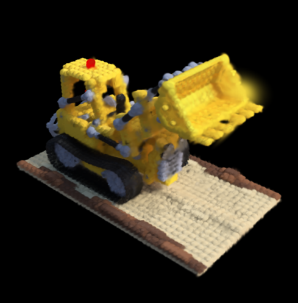

# Improved Variational Bayes Gaussian Splatting

ImprovedVBGS is a faster implementation of VBGS training. Using sparse top-M CAVI
responsibilities, a densification strategy and improved reassignment. On an NVIDIA 3070Ti (8GB) a 200 frame training is completed in ~1 minute, which is a significant improvement over the baseline ~234 minutes on an NVIDIA A500 which would OOM on 8GB of VRAM. It is also a significant improvement on the follow up paper which reports ~61 minutes on the same hardware (code unavailable).



Current Lego static-reassignment run: 100k components, 200 frames, 2.7 min
training, 21.42 dB validation PSNR.


Current TUM `freiburg1_xyz` 100k-component unified run, highest-PSNR
validation prediction.

## Install

Requirements: Python 3.11, CUDA GPU, JAX CUDA build.

```bash
cd src/vbgs
conda create -n improved-vbgs python=3.11 -y
conda activate improved-vbgs
bash install_deps.sh
pip install -e .[gpu]
```

External repositories belong under `third_party/`, not `src/`.

## Outputs

Generated runs go under `src/vbgs/output/`. Do not write experiment outputs to
`src/vbgs/scripts/data/`; output path validation rejects that layout. Run names
are shortened automatically.

## Blender Objects

Download NeRF Synthetic Blender data:

```bash
mkdir -p data/blender
wget http://cseweb.ucsd.edu/~viscomp/projects/LF/papers/ECCV20/nerf/nerf_synthetic.zip \
  -O data/blender/nerf_synthetic.zip
unzip data/blender/nerf_synthetic.zip -d data/blender
```

Convert Lego to the standard scene format:

```bash
python src/preprocess/preprocess.py blender \
  --input data/blender/lego \
  --output data/scenes/lego
```

Convert all Blender scenes:

```bash
for scene in chair drums ficus hotdog lego materials mic ship; do
  python src/preprocess/preprocess.py blender \
    --input "data/blender/${scene}" \
    --output "data/scenes/${scene}"
done
```

Train Lego with the unified scene trainer:

```bash

cd src/vbgs/scripts
python train.py \
  --data-path ../../../data/blender/lego \
  --run-name lego \
  --components 100000 \
  --frames 200 \
  --batch-size 250000 \
  --top-m 1 \
  --candidate-m 4 \
  --init random \
  --no-densify \
  --reassign \
  --reassign-every 1 \
  --reassign-fraction 0.05 \
  --precision fp64 \
  --no-eval
```

Train all preprocessed Blender scenes:

```bash
for scene in chair drums ficus hotdog lego materials mic ship; do
  python train.py \
    --data-path "../../../data/scenes/${scene}" \
    --run-name "${scene}" \
    --components 100000 \
    --frames 200 \
    --batch-size 250000 \
    --top-m 1 \
    --candidate-m 4 \
    --init random \
    --no-densify \
    --precision fp64 \
    --eval
done
```

Evaluate and save renders:

```bash
python eval.py \
  ../output/lego/model_final.json \
  --data-path ../../data/blender/lego \
  --save-images
```

## TUM RGB-D

Download the TUM `freiburg1_xyz` sequence:

```bash
mkdir -p data/tum
wget https://cvg.cit.tum.de/rgbd/dataset/freiburg1/rgbd_dataset_freiburg1_xyz.tgz \
  -O data/tum/rgbd_dataset_freiburg1_xyz.tgz
tar -xzf data/tum/rgbd_dataset_freiburg1_xyz.tgz -C data/tum
```

Preprocess into the same folder (adds `train/`, `val/`, and `transforms_*.json`
alongside the raw TUM files):

```bash
python src/preprocess/preprocess.py tum-rgbd \
  --input data/tum/rgbd_dataset_freiburg1_xyz \
  --output data/tum/rgbd_dataset_freiburg1_xyz \
  --frames 798 \
  --stride 1 \
  --val-stride 3
```

Train TUM with the unified scene trainer and the same core sparse settings as
Lego:

```bash
cd src/vbgs/scripts
python train.py \
  --data-path ../../../data/tum/rgbd_dataset_freiburg1_xyz \
 --run-name freiburg1_xyz \
  --components 100000 \
  --frames 530 \
  --batch-size 250000 \
  --top-m 1 \
  --candidate-m 4 \
  --init random \
  --no-densify \
  --reassign \
  --reassign-every 1 \
  --reassign-fraction 0.05 \
  --precision fp64 \
  --no-eval
```

## Standard Scene Format

The unified trainer accepts preprocessed RGB-D scenes:

```text
data/scenes/<scene>/
  manifest.json
  transforms_train.json
  transforms_val.json
  train/
    frame_000000.png
    frame_000000_depth_da3.npy
  val/
    frame_000008.png
    frame_000008_depth_da3.npy
```

Convert Blender or TUM into that format with `src/preprocess/preprocess.py`.
For MP4 inputs, the preprocessor uses Depth Anything 3 to estimate both
per-frame depth and camera poses:

```bash
cd src/vbgs
pip install -e ".[depth]"
cd ../..

python src/preprocess/preprocess.py video \
  --input data/videos/scene.mp4 \
  --output data/scenes/scene_from_video \
  --frames 200 \
  --stride 1 \
  --depth-source da3 \
  --pose-source da3 \
  --da3-model depth-anything/DA3-BASE
```

Depth Anything 3 estimates relative depth and camera extrinsics/intrinsics from
the extracted video frames. The preprocessor rescales each depth map to
`--depth-median` meters, which defaults to `1.0`, and converts DA3 camera poses
into the Blender-style camera-to-world matrices used by the trainer. Add
`--da3-use-ray-pose` for DA3's slower ray-head pose path.

If you already have estimates, use:

```bash
python src/preprocess/preprocess.py video \
  --input data/videos/scene.mp4 \
  --output data/scenes/scene_from_video \
  --depth-source dir \
  --depth-dir data/videos/scene_depth \
  --pose-source file \
  --pose-file data/videos/scene_transforms.json
```

`--depth-source placeholder` or `--pose-source stationary` are smoke-test modes
only and should not be used for reconstruction results.

## Semantic Variant

Semantic training appends continuous SAM/CLIP feature vectors after `[xyz, rgb]`.
Those features are another VBGS observation block and are updated by CAVI using
the same responsibilities as color.

## References

- VBGS: [arXiv:2410.03592](https://arxiv.org/abs/2410.03592)
- VBGS optimization study: [arXiv:2603.08499](https://arxiv.org/abs/2603.08499)

## License

`src/vbgs` remains under the [VERSES Academic Research License](src/vbgs/LICENSE.txt).
